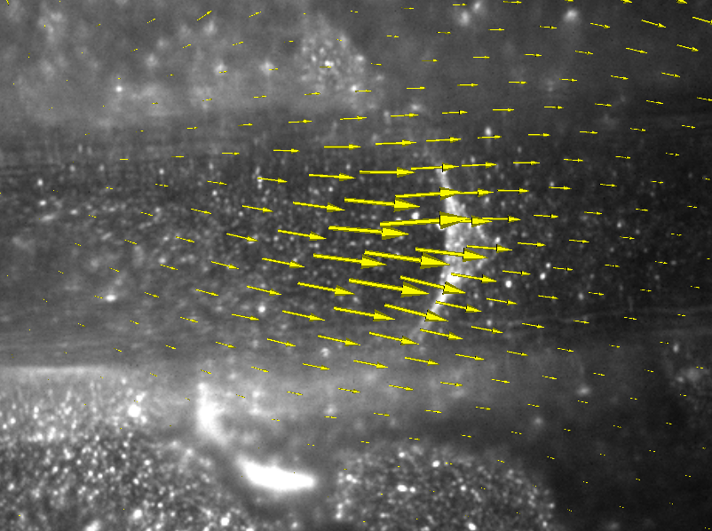

# ImageTracker

ImageTracker is a motion analysis application specifically designed for video microscopy. ImageTracker can stabilize image sequences with respect to moving objects, remove the effect of stationary components from bright field images, and compute and visualize dense displacement fields that explain motion in image sequences (optical flow). New in ImageTracker 3.0 is the ability to apply numerous image filters as well as an improved multi-resolution optical flow implementation.

ImageTracker was developed by the UNC National Research Resource: Computer Integrated Systems for Microscopy and Manipulation (CISMM), funded by the NIH.

